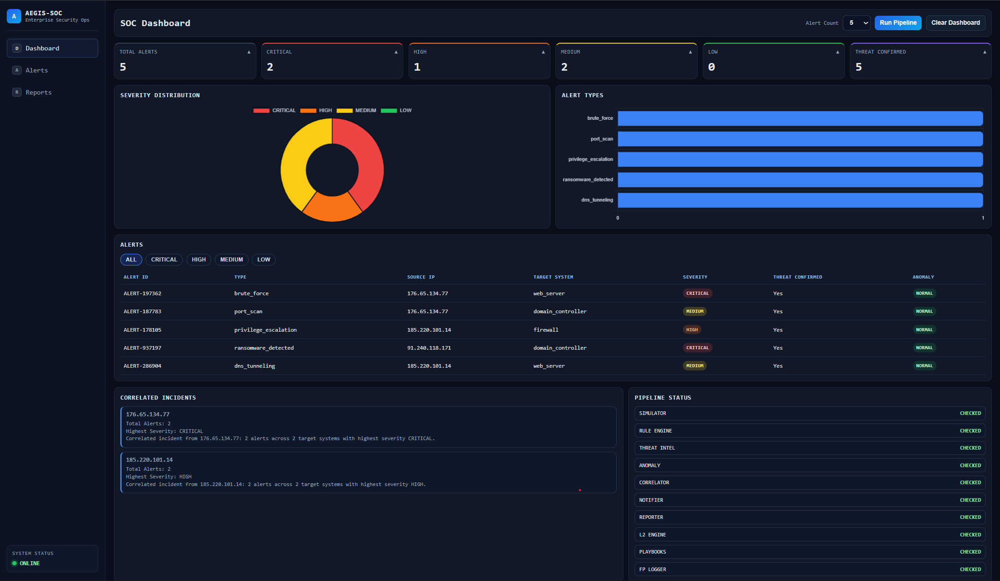

```
 █████╗ ███████╗ ██████╗ ██╗███████╗      ███████╗ ██████╗  ██████╗
██╔══██╗██╔════╝██╔════╝ ██║██╔════╝      ██╔════╝██╔═══██╗██╔════╝
███████║█████╗  ██║  ███╗██║███████╗      ███████╗██║   ██║██║
██╔══██║██╔══╝  ██║   ██║██║╚════██║      ╚════██║██║   ██║██║
██║  ██║███████╗╚██████╔╝██║███████║      ███████║╚██████╔╝╚██████╗
╚═╝  ╚═╝╚══════╝ ╚═════╝ ╚═╝╚══════╝      ╚══════╝ ╚═════╝  ╚═════╝
```

```
SYSTEM     : Automated L1 SOC Triage System
VERSION    : 4.0
STATUS     : ACTIVE
CLEARANCE  : OPEN SOURCE
```

---

## OVERVIEW

Aegis-SOC is a modular, open source cybersecurity automation tool built to eliminate the bottleneck of manual L1 SOC triage. The system ingests simulated security alerts, runs them through a rule-based classification engine, enriches threat indicators against dual external intelligence sources, dispatches real-time critical notifications, and maintains a structured false positive registry.

Built by a cybersecurity aspirant as a serious contribution to the SOC automation space.

---
## DASHBOARD PREVIEW


---

## FEATURES

```
[+]  Realistic Alert Simulation       10 attack vectors across 5 target systems
[+]  Rule Based Classification        LOW / MEDIUM / HIGH / CRITICAL severity engine
[+]  Dual Source Threat Intel         AbuseIPDB + VirusTotal cross-validation
[+]  Email Notifications              Real-time CRITICAL alert dispatch via Gmail SMTP
[+]  Structured Report Generation     Console + JSON incident reports per alert
[+]  False Positive Tracking          Persistent FP registry for rule tuning
[+]  L2 Investigation Engine          Automated deep analysis with isolation recommendations
[+]  Alert Correlation                Multi-vector attack detection by source IP grouping
[+]  Wazuh SIEM Integration           Wazuh compatible ingestion layer for live connectivity
[+]  Automated Response Playbooks     Step-by-step incident response for 6 attack types
[+]  Anomaly Detection Engine         Z-score based statistical anomaly detection
[+]  Live SOC Dashboard               Flask web dashboard with charts, alerts table, and pipeline control
```

## THREAT PIPELINE

```
[SIMULATOR/WAZUH] → [RULE ENGINE] → [THREAT INTEL] → [ANOMALY DETECTOR] → [CORRELATOR] → [NOTIFIER] → [REPORTER] → [L2 ENGINE] → [PLAYBOOKS] → [FP LOGGER]

```

## PIPELINE ARCHITECTURE
```
INPUT LAYER
  ├── Alert Simulator      →  10 attack vectors, synthetic alerts
  └── Wazuh Ingestor       →  SIEM compatible ingestion

PROCESSING LAYER
  ├── Rule Engine          →  Severity classification (LOW/MED/HIGH/CRIT)
  ├── Threat Intel         →  AbuseIPDB + VirusTotal enrichment
  ├── Anomaly Detector     →  Z-score statistical analysis
  └── Alert Correlator     →  Multi-vector attack grouping

OUTPUT LAYER
  ├── Email Notifier       →  CRITICAL alert dispatch
  ├── Report Generator     →  JSON + Console incident reports
  ├── L2 Investigator      →  Impact assessment + isolation rec.
  ├── Response Playbooks   →  Step-by-step incident response
  └── FP Logger            →  False positive registry

```
| Stage | Module | Function |
|---|---|---|
| 01 | Alert Simulator / Wazuh Ingestor | Generates or ingests security alerts |
| 02 | Rule Engine | Classifies severity — LOW / MEDIUM / HIGH / CRITICAL |
| 03 | Threat Intel | Dual source enrichment via AbuseIPDB + VirusTotal |
| 04 | Alert Correlator | Groups related alerts by source IP |
| 05 | Email Notifier | Dispatches analyst notifications for CRITICAL incidents |
| 06 | Report Generator | Outputs structured console + JSON incident reports |
| 07 | L2 Investigation Engine | Deep automated analysis for CRITICAL alerts |
| 08 | FP Logger | Maintains persistent false positive registry |

---

## SEVERITY MATRIX

```
CRITICAL  [████████████]  Immediate escalation. Isolate affected system.
HIGH      [████████░░░░]  Investigate immediately. Review related logs.
MEDIUM    [████░░░░░░░░]  Monitor closely. Cross-reference threat intel.
LOW       [██░░░░░░░░░░]  Likely false positive. Log and discard.
```

---

## ATTACK VECTORS COVERED

```
failed_login          brute_force           malware_detected
port_scan             suspicious_connection ransomware_detected
privilege_escalation  ddos_attack           unauthorized_wifi_access
dns_tunneling
```

---

## SYSTEM STRUCTURE

```
Aegis-SOC/
│
├── main.py                        # Pipeline entry point
├── config/
│   └── config.py                  # Central configuration
├── simulator/
│   └── alert_simulator.py         # Alert simulation module
├── engine/
│   └── rule_engine.py             # Rule based classification engine
├── enrichment/
│   └── threat_intel.py            # AbuseIPDB + VirusTotal enrichment
├── notifier/
│   └── email_notifier.py          # Critical alert notifications
├── reporter/
│   └── report_generator.py        # Incident report generation
├── logger/
│   └── false_positive_logger.py   # False positive registry
├── l2_investigator/
│   └── l2_engine.py                  # L2 automated investigation engine
├── correlator/
│   └── alert_correlator.py           # Multi-vector alert correlation
├── integrations/
│   └── wazuh_ingestor.py             # Wazuh SIEM ingestion layer
├── l2_reports/                        # L2 investigation reports
├── correlation_reports/               # Correlation reports
├── anomaly/
│   └── anomaly_detector.py           # Z-score based anomaly detection
├── playbooks/
│   └── response_playbooks.py         # Automated incident response playbooks
├── dashboard/
│   ├── app.py                        # Flask dashboard server
│   └── templates/
│       └── index.html                # SOC dashboard UI
├── reports/                       # Generated incident reports
├── requirements.txt               # Dependencies
└── README.md                      # Documentation

```

---

## DEPLOYMENT

**Requirements**
- Python 3.x
- AbuseIPDB API key — [abuseipdb.com](https://abuseipdb.com)
- VirusTotal API key — [virustotal.com](https://virustotal.com)
- Gmail account with App Password enabled

**Installation**
```bash
git clone https://github.com/yourusername/Aegis-SOC.git
cd Aegis-SOC
pip install -r requirements.txt
```

**Environment Configuration**

Create a `.env` file in the root directory:
```
ABUSEIPDB_API_KEY=your_abuseipdb_key
VIRUSTOTAL_API_KEY=your_virustotal_key
EMAIL_SENDER=your_gmail@gmail.com
EMAIL_PASSWORD=your_gmail_app_password
EMAIL_RECEIVER=your_gmail@gmail.com
```

**Execute**
```bash
python main.py
```

**Run Dashboard**
```bash
python -m dashboard.app
```
Then open http://localhost:5000 in your browser.
---


## ROADMAP

```
[COMPLETE]  V1 — Core triage pipeline
[COMPLETE]  V2 — Dual threat intel, email alerts, FP tracking
[COMPLETE]  V3 — L2 automation, Wazuh SIEM integration, alert correlation
[COMPLETE]  V4 — Dashboard UI, anomaly detection, response playbooks
[PLANNED]   V5 — ML based detection, live SIEM feed, multi-user support
```

---

## CONTRIBUTING

```
1. Fork the repository
2. git checkout -b feature/your-feature
3. git commit -m "Add your feature"
4. git push origin feature/your-feature
5. Open a Pull Request
```

---

## LICENSE

MIT License — free to use, modify, and distribute.

---

```
[ AEGIS-SOC ] — AUTOMATED THREAT TRIAGE — OPEN SOURCE
```