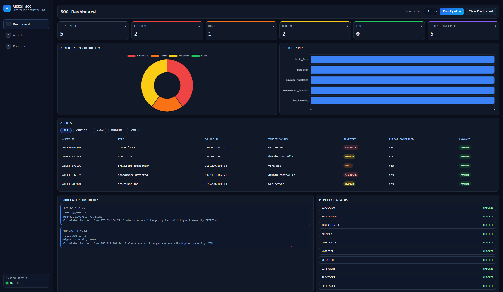
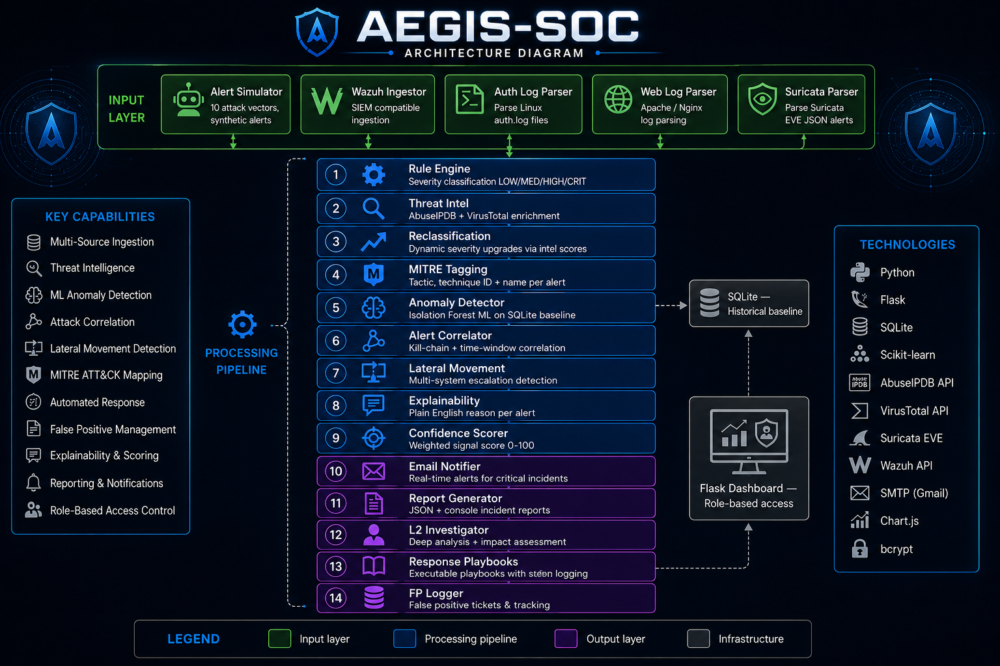

  ```
  █████╗ ███████╗ ██████╗ ██╗███████╗      ███████╗ ██████╗  ██████╗
  ██╔══██╗██╔════╝██╔════╝ ██║██╔════╝      ██╔════╝██╔═══██╗██╔════╝
  ███████║█████╗  ██║  ███╗██║███████╗      ███████╗██║   ██║██║
  ██╔══██║██╔══╝  ██║   ██║██║╚════██║      ╚════██║██║   ██║██║
  ██║  ██║███████╗╚██████╔╝██║███████║      ███████║╚██████╔╝╚██████╗
  ╚═╝  ╚═╝╚══════╝ ╚═════╝ ╚═╝╚══════╝      ╚══════╝ ╚═════╝  ╚═════╝
  ```

  ```
  SYSTEM     : Automated L1 SOC Triage System
  VERSION    : 9.0
  STATUS     : ACTIVE
  CLEARANCE  : OPEN SOURCE
  ```
Aegis-SOC queries real threat intelligence APIs and flags confirmed malicious IPs automatically.
It detects kill-chain attack sequences across correlated alerts.
It simulates and automates core aspects of L1 and L2 SOC triage — from alert ingestion to investigation and response — in a single pipeline.
  ---

  ## OVERVIEW

  Aegis-SOC is a modular, open source SOC triage pipeline designed to simulates and automates core L1/L2 SOC triage workflows. The system generates or ingests alerts from multiple sources, applies a rule-based classification engine, and performs dual-source enrichment against AbuseIPDB and VirusTotal. Alerts receive dynamic severity reclassification based on threat intel scores, then flow into an Isolation Forest anomaly detector that uses historical alert patterns to identify unusual activity. Correlated alerts are analyzed for rapid time-window attacks and heuristic-based kill-chain sequences to surface multi-vector campaigns. The platform supports automated email notifications for critical incidents, structured JSON and console report generation, an L2 investigation engine with impact assessment and isolation recommendations, and a library of response playbooks. False positives are automatically logged and tracked through a ticketing workflow, and a secured Flask dashboard with role-based authentication provides operators with controlled access and visualization. Every alert is accompanied by a plain English explanation of why it was flagged, and a confidence score from 0 to 100 reflecting the weighted strength of detection signals.

  ---
  ## DASHBOARD PREVIEW

  
  ---

  ## FEATURES

  ```
  [+]  Realistic Alert Simulation       10 attack vectors across 5 target systems
  [+]  Rule Based Classification        LOW / MEDIUM / HIGH / CRITICAL severity engine
  [+]  Dual Source Threat Intel         AbuseIPDB + VirusTotal cross-validation
  [+]  Email Notifications              Real-time CRITICAL alert dispatch via Gmail SMTP
  [+]  Structured Report Generation     Console + JSON incident reports per alert
  [+]  False Positive Tracking          Persistent FP registry for rule tuning
  [+]  L2 Investigation Engine          Automated deep analysis with isolation recommendations
  [+]  Alert Correlation                Multi-vector attack detection by source IP grouping
  [+]  Wazuh SIEM Integration           Wazuh compatible ingestion layer for live connectivity
  [+]  Automated Response Playbooks     Step-by-step incident response for 6 attack types
  [+]  Anomaly Detection Engine         Isolation Forest ML based anomaly detection
  [+]  AbuseIPDB Category Extraction    Maps abuse category codes to human-readable attack types
  [+]  File Hash Analysis               SHA256 malware hash lookup via VirusTotal
  [+]  MITRE ATT&CK Tagging            Every alert tagged with tactic, technique ID and technique name
  [+]  Smarter Alert Simulation         Privilege escalation only generated after brute force or failed login
  [+]  Live SOC Dashboard               Flask web dashboard with charts, alerts table, and pipeline control
  [+]  Auth Log Ingestion              Parse real Linux auth.log files into alerts
  [+]  Dashboard File Upload           Upload real log files through the browser UI
  [+]  Threat Intel Reclassification    Severity upgraded dynamically based on AbuseIPDB and VirusTotal scores
  [+]  Kill-Chain Sequence Detection    Identifies known attack chains across correlated alerts
  [+]  Time-Window Correlation          Flags rapid multi-alert attacks within 60 second windows
  [+]  SQLite Historical Baseline       Persistent alert history for statistically meaningful anomaly detection
  [+]  Dashboard Authentication         Session-based login with environment configured credentials
  [+]  False Positive Ticketing         Auto-creates SQLite tickets with OPEN/IN_PROGRESS/CLOSED workflow
  [+]  Multi-User Dashboard             Admin and analyst roles with bcrypt password hashing and user management
  [+]  Executable Playbook Logging      Every playbook step records SIMULATED status with timestamp and execution summary
  [+]  78 Automated Unit Tests          78 automated unit tests across core modules
  [+]  Apache/Nginx Log Parser          Detects brute force, SQL injection, and path reconnaissance from web logs
  [+]  Suricata NIDS Integration         Parses Suricata EVE JSON alerts directly into the pipeline
  [+]  Lateral Movement Detection        Flags attackers escalating across multiple target systems
  [+]  Alert Explainability         Every alert includes a plain English explanation of why it was flagged
  [+]  Confidence Scoring           Weighted signal score (0-100) per alert reflecting detection certainty
  [+]  Port Scan Playbook           Dedicated response playbook for port scan alerts
  ```
## PIPELINE ARCHITECTURE


  ```

  ```
  | Stage | Module | Function |
  |---|---|---|
  | 01 | Alert Simulator / Wazuh Ingestor | Generates or ingests security alerts |
  | 02 | Rule Engine | Classifies severity — LOW / MEDIUM / HIGH / CRITICAL |
  | 03 | Threat Intel | Dual source enrichment via AbuseIPDB + VirusTotal |
  | 03b | Threat Intel Reclassification | Upgrades severity based on abuse and VirusTotal scores |
  | 04 | Alert Correlator | Groups related alerts by source IP |
  | 05 | Email Notifier | Dispatches analyst notifications for CRITICAL incidents |
  | 06 | Report Generator | Outputs structured console + JSON incident reports |
  | 07 | L2 Investigation Engine | Deep automated analysis for CRITICAL alerts |
  | 08 | FP Logger | Maintains persistent false positive registry |

## EXAMPLE INVESTIGATION

> **Scenario:** Brute force attack detected via Linux auth.log ingestion
**Input — Raw Log (sample_logs/auth.log)**
```
May  2 04:17:32 secserver sshd[12847]: Invalid user root from 185.220.101.14 port 52184
May  2 04:17:33 secserver sshd[12848]: Failed password for invalid user root from 185.220.101.14 port 52185 ssh2
... (15 attempts total in 70 seconds)
```

**Pipeline Execution**

| Stage | Action | Result |
|---|---|---|
| Auth Log Parser | Groups 15 failed SSH attempts from same IP | brute_force alert generated |
| Rule Engine | Matches brute_force rule | Severity -> CRITICAL |
| Threat Intel | Queries AbuseIPDB + VirusTotal | abuse_score: 100, virustotal_score: 11 |
| Reclassification | abuse_score > 90 | Severity confirmed CRITICAL |
| MITRE Tagging | Maps brute_force | T1110 - Brute Force, Credential Access |
| Anomaly Detector | Isolation Forest ML flags unusual attempt_count and IP frequency | is_anomaly: True |
| Confidence Scorer | threat_confirmed + is_anomaly + abuse_score > 75 signals | confidence_score: 55 |
| L2 Investigator | CRITICAL alert triggers deep investigation | Isolation recommended |
| Response Playbooks | brute_force playbook triggered | Step-by-step response executed |

**Output — Generated Alert**
```json
{
  "alert_id": "AUTHLOG-299225",
  "source_ip": "185.220.101.14",
  "alert_type": "brute_force",
  "severity": "CRITICAL",
  "abuse_score": 100,
  "virustotal_score": 11,
  "threat_confirmed": true,
  "mitre_tactic": "Credential Access",
  "mitre_technique_id": "T1110",
  "is_anomaly": true,
  "confidence_score": 55,
  "explanation": [
    "Alert type: brute_force",
    "MITRE: Credential Access — T1110",
    "AbuseIPDB score: 100, VirusTotal score: 11 — threat confirmed",
    "Flagged as anomaly by ML detector (score: -0.0219)"
  ],
  "recommended_action": "Immediate escalation to L2. Isolate affected system."
}
```

**Verdict:** Real malicious IP confirmed by two independent threat intel sources. ML anomaly detection flagged unusual activity. Automated L2 investigation and brute force playbook triggered immediately.

  ---

  ## SEVERITY MATRIX

  ```
  CRITICAL  [████████████]  Immediate escalation. Isolate affected system.
  HIGH      [████████░░░░]  Investigate immediately. Review related logs.
  MEDIUM    [████░░░░░░░░]  Monitor closely. Cross-reference threat intel.
  LOW       [██░░░░░░░░░░]  Likely false positive. Log and discard.
  ```

  ---

  ## ATTACK VECTORS COVERED

  ```
  failed_login          brute_force           malware_detected
  port_scan             suspicious_connection ransomware_detected
  privilege_escalation  ddos_attack           unauthorized_wifi_access
  dns_tunneling
  ```

> Note: ransomware_detected alerts are most meaningful when detected as part of a kill-chain sequence. Aegis-SOC models this through kill-chain detection in the correlator module.

  ---

  ## SYSTEM STRUCTURE

  ```
  Aegis-SOC/
  │
  ├── main.py                        # Pipeline entry point
  ├── config/
  │   └── config.py                  # Central configuration
  ├── simulator/
  │   └── alert_simulator.py         # Alert simulation module
  ├── engine/
  │   └── rule_engine.py             # Rule based classification engine
  ├── storage/
  │   └── history_store.py              # SQLite historical alert persistence
  ├── auth/
  │   └── user_manager.py               # Multi-user authentication and role management
  ├── log_parser/
  │   ├── auth_log_parser.py            # Linux auth.log parser
  │   ├── web_log_parser.py             # Apache/Nginx access log parser
  │   └── suricata_parser.py            # Suricata EVE JSON log parser
  ├── sample_logs/
  │   ├── auth.log                      # Sample auth.log for testing
  │   ├── access.log                    # Sample Apache/Nginx log for testing
  │   └── suricata.json                 # Sample Suricata EVE JSON log for testing
  ├── enrichment/
  │   └── threat_intel.py            # AbuseIPDB + VirusTotal enrichment
  ├── notifier/
  │   └── email_notifier.py          # Critical alert notifications
  ├── reporter/
  │   └── report_generator.py        # Incident report generation
  ├── logger/
  │   └── false_positive_logger.py   # False positive registry
  ├── ticketing/
  │   └── ticket_manager.py             # False positive ticket lifecycle management
  ├── l2_investigator/
  │   └── l2_engine.py                  # L2 automated investigation engine
  ├── correlator/
  │   └── alert_correlator.py           # Multi-vector alert correlation
  ├── explainability/
  │   └── explainer.py                  # Alert explainability module
  ├── confidence/
  │   └── confidence_scorer.py          # Alert confidence scoring module
  ├── integrations/
  │   └── wazuh_ingestor.py             # Wazuh SIEM ingestion layer
  ├── l2_reports/                        # L2 investigation reports
  ├── correlation_reports/               # Correlation reports
  ├── lateral_movement/
  │   └── lateral_detector.py           # Lateral movement detection module
  ├── lateral_movement_reports/          # Lateral movement detection reports
  ├── anomaly/
  │   └── anomaly_detector.py           # Isolation Forest ML anomaly detection
  ├── playbooks/
  │   └── response_playbooks.py         # Automated incident response playbooks
  ├── dashboard/
  │   ├── app.py                        # Flask dashboard server
  │   └── templates/
  │       └── index.html                # SOC dashboard UI
  ├── reports/                       # Generated incident reports
  ├── requirements.txt               # Dependencies
  └── README.md                      # Documentation

  ```

  ---

  ## DEPLOYMENT

  **Requirements**
  - Python 3.x
  - AbuseIPDB API key — [abuseipdb.com](https://abuseipdb.com)
  - VirusTotal API key — [virustotal.com](https://virustotal.com)
  - Gmail account with App Password enabled

  **Installation**
  ```bash
  git clone https://github.com/rudrasingh-007/Aegis-SOC.git
  cd Aegis-SOC
  pip install -r requirements.txt
  ```

  **Environment Configuration**

  Create a `.env` file in the root directory:
  ```
  ABUSEIPDB_API_KEY=your_abuseipdb_key
  VIRUSTOTAL_API_KEY=your_virustotal_key
  EMAIL_SENDER=your_gmail@gmail.com
  EMAIL_PASSWORD=your_gmail_app_password
  EMAIL_RECEIVER=your_gmail@gmail.com
  DASHBOARD_USERNAME=your_dashboard_username
  DASHBOARD_PASSWORD=your_dashboard_password
  FLASK_SECRET_KEY=your_secret_key
  ```

  **Execute**
  ```bash
  python main.py
  ```

  **Run Dashboard**
  ```bash
  python -m dashboard.app
  ```
Then open http://localhost:5000 in your browser.

To logout: click the Logout button in the sidebar or visit http://localhost:5000/logout in your browser.

  ---

  **Upload Real Logs**
  
  Upload a Linux auth.log file through the dashboard UI to process real log data instead of simulated alerts.
  
  ## TESTING

  Run all 78 unit tests with:
  ```bash
  python -m pytest tests/ -v
  ```


  ## ROADMAP

  ```
  [COMPLETE]  V1 — Core triage pipeline
  [COMPLETE]  V2 — Dual threat intel, email alerts, FP tracking
  [COMPLETE]  V3 — L2 automation, Wazuh SIEM integration, alert correlation
  [COMPLETE]  V4 — Dashboard UI, anomaly detection, response playbooks
  [COMPLETE]  V5 — Kill-chain detection, threat intel reclassification, SQLite baseline, dashboard auth, 43 unit tests
  [COMPLETE]  V6 — MITRE ATT&CK tagging, file hash analysis, Isolation Forest ML, AbuseIPDB categories, smarter simulation
  [COMPLETE]  V7 — Web log parser, Suricata NIDS integration, lateral movement detection, 58 unit tests
  [COMPLETE]  V8 — False positive ticketing, multi-user dashboard, executable playbook logging, 68 unit tests
  [COMPLETE]  V9 — Alert explainability, confidence scoring, port scan playbook, dashboard chart redesign, 78 unit tests
  [PLANNED]   V10 — Docker containerization, WebSocket dashboard, live SIEM feed
  ```

  ---

  ## CONTRIBUTING

  ```
  1. Fork the repository
  2. git checkout -b feature/your-feature
  3. git commit -m "Add your feature"
  4. git push origin feature/your-feature
  5. Open a Pull Request
  ```

  ---

  ## LICENSE

  MIT License — free to use, modify, and distribute.

  ---

  ```
  [ AEGIS-SOC ] — AUTOMATED THREAT TRIAGE — OPEN SOURCE
  ```